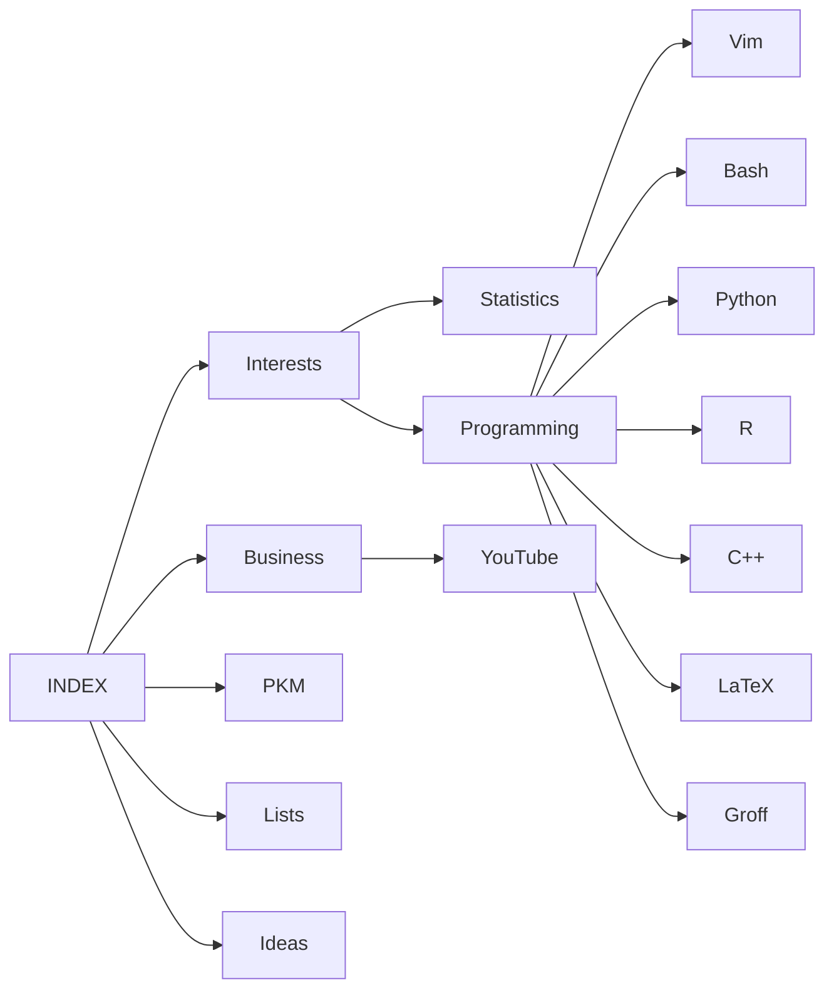

```
 ____  ______   __ _    _   _ _ ____    ___ _   _ ____  _______  __
| __ )|  _ \ \ / // \  | \ | ( ) ___|  |_ _| \ | |  _ \| ____\ \/ /
|  _ \| |_) \ V // _ \ |  \| |/\___ \   | ||  \| | | | |  _|  \  / 
| |_) |  _ < | |/ ___ \| |\  |  ___) |  | || |\  | |_| | |___ /  \ 
|____/|_| \_\|_/_/   \_\_| \_| |____/  |___|_| \_|____/|_____/_/\_\
```

> All your notes are belong to us

### Emerging Structure

> See [[INDEX#The MAP of MOC|The MAP of MOC]]

- [[INDEX]]
- [[Interests]] 
- [[Business]]
- [[PKM]] & [[Lists]]
- [[Ideas]]

---

![[🧠️ Top of Mind]]

---

#### Tag Definitions & Groupings

- #📥️ ==Seed box | items that i am / will be actively working on==
- #🌱️ ==Seedlings | distilled from literature notes==
- #🌞️ ==Incubator | items not yet ready for planting or in need of planting==
- #🌲️ ==Evergreen | forest notes==
- #✏️ ==Workbench Note | Tagging salient points for consolidation on the workbench== 
	- [[✏️ Workbench]]
<br>
- #✅️ ==Items that have tasks that i need to complete==
- #🗺️ ==Maps of Content (the emerging organizational structure)==
- #⚙️ ==General utilities i use in this system==
	- [[♻️ Workflows]]
	- [[🔌️ Plugins]]
	- [[🛑 Thinking About That]]
- #❗️ ==IMPORTANT==
- #🏷️ ==Tag Notes==
	- [[🔗️☁️]] 

### Types of Content

- `@`: Person 
<br>
- `{`: Books, eBooks, or Audio Books 
- `!`: Tweets
- `%`: Podcasts / Audio media
- `+`: YouTube Videos
- `(`: Web Articles or Publications, Newspapers, etc.
- `&`: Research Paper
- `-`: 

#### Simple Drawing Creation

https://excalidraw.com/

###### Build Index of Links & Counts

```bash
egrep -ohsr --exclude-dir='.*' "\[\[[A-Za-z0-9 _@ÄÖÜäöüß\'\!\?\.\(\)\-]+\]\]" -- * | sed -e 's/[[:space:]]#/#/' | sort | uniq -c | sort -r -t# -k2  > "🔗️☁️.md"
```


## The MAP of MOC



