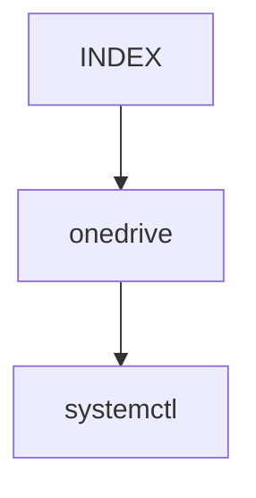

[mermaid live editor](https://mermaid-js.github.io/mermaid-live-editor/#/edit/eyJjb2RlIjoiZ3JhcGggVERcbiAgQVtDaHJpc3RtYXNdIC0tPnxHZXQgbW9uZXl8IEIoR28gc2hvcHBpbmcpXG4gIEIgLS0-IEN7TGV0IG1lIHRoaW5rfVxuICBDIC0tPnxPbmV8IERbTGFwdG9wXVxuICBDIC0tPnxUd298IEVbaVBob25lXVxuICBDIC0tPnxUaHJlZXwgRltmYTpmYS1jYXIgQ2FyXVxuXHRcdCIsIm1lcm1haWQiOnsidGhlbWUiOiJkZWZhdWx0In19)

